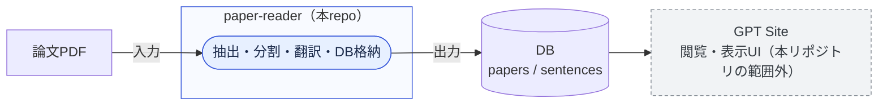

# paper-reader

英語論文PDFを読解しやすい形に前処理するツール。抽出・翻訳・DB格納までを担当。

## 1. ツールの概要

GPT Site上で、論文の原文と日本語訳を行き来しながら読める論文読解支援ツールの一部として、
本リポジトリは以下を担当する。

> 論文PDFから本文を抽出し、文単位に分割・レビューし、日本語へ翻訳して、閲覧用DBへ渡すところまで

処理はSkill（LLMによる判断が必要な工程）とProgram（決定論的に実行できる工程）に分離している。
全体のワークフローは[docs/01_workflow.md](docs/01_workflow.md)、DBスキーマは[docs/03_db.md](docs/03_db.md)、
中間CSVの列定義は[docs/02_csv-schema.md](docs/02_csv-schema.md)を参照。

## 2. 本リポジトリの立ち位置

GPT Site側の閲覧・表示UIは本リポジトリの範囲外。DBスキーマを共有インターフェースとして、
閲覧アプリ側から参照される想定。



## 3. 実行手順例

### 3.1 通常の流れ（Claude Code / Codexに一任する）

1. 対象PDFを`pdf/<論文名>.pdf`に配置する（無くてもよい。無ければ`01-01-fetch-pdf`がGoogle Driveから取得する）
2. Claude Code もしくは Codex に「`pdf/<論文名>.pdf`を処理して」のように指示する

指示を受けたLLMは、[docs/01_workflow.md](docs/01_workflow.md)に定義された`01-01-fetch-pdf`〜`06-01-load-to-db`の
Skillを順番に実行し、PDF取得からDB格納まで通しで進める。

### 3.2 特定の処理だけ切り出したい場合

決定論的な処理（Skillを介さない）は`Makefile`にターゲットとして定義済みなので、直接呼び出せる。

```bash
make extract PDF=pdf/paper.pdf OUT=output   # PDF→Markdown抽出（Docker経由）
make split REVIEW=output/paper/paper_review.md  # レビュー済みMarkdown→CSV
make db-upgrade                                  # DBスキーマを最新へ（Alembic）
make load-db CSV=output/paper/paper.csv  # CSV→DB格納
```

上記以外のターゲット（`lint`/`format`/`format-check`/`clean`/`db-revision`等）を含む一覧は`make help`で確認できる。
詳細は[Makefile](Makefile)を参照。

## 4. フォルダ構成

```
paper-reader/
├── pdf/                  # 処理対象PDFの格納先
├── output/<論文名>/       # 論文ごとの中間成果物（Markdown・CSV・表画像）
├── preprocess/           # PDF→Markdown抽出。marker-pdf + PyMuPDF、Docker/devcontainer経由で実行
│   └── src/extract_pdf.py
├── postprocess/          # 文分割・翻訳補助・DB格納。軽量venv（uv管理）、Docker不要
│   ├── src/              # split_sentences.py / apply_translations.py / check_translation.py / load_to_db.py / db/
│   └── migrations/       # Alembicマイグレーション
├── config/               # 接続設定。settings.toml（共有）/ settings.local.toml（秘密情報、gitignore対象）
├── docs/                 # ワークフロー・DBスキーマ・CSVスキーマ等のドキュメント
├── .claude/skills/, .claude/agents/   # Claude Code向けSkill定義・subagent定義
├── .agents/skills/, .codex/agents/    # Codex向けSkill定義・subagent定義（内容は.claude側と対応）
└── Makefile              # 各Programの実行コマンド集
```

## 5. 出力内容

### output/`<論文名>`/ 配下

| ファイル | 内容 |
| --- | --- |
| `<論文名>.md` | PDFからの抽出直後のMarkdown（以降変更しない、差分確認の基準） |
| `<論文名>_review.md` | 見出し構造・数式を修正したレビュー済みMarkdown |
| `<論文名>.csv` | 文単位に分割し、日本語訳を格納した最終CSV（列定義は[docs/02_csv-schema.md](docs/02_csv-schema.md)） |
| `<論文名>_flags.csv` | 文分割レビュー用の自動検出候補（レビュー後は消費済み） |
| `<論文名>_translation_flags.csv` | 翻訳レビュー用の自動検出候補（レビュー後は消費済み） |
| `tables/` | PyMuPDFで切り出した表の画像 |

### DB

`<論文名>.csv`を検証した上で、Postgres互換DBの下記テーブルへ格納。
- `papers`（論文単位）
- `sentences`（文単位、原文＋翻訳文）

スキーマ・接続設定・マイグレーション運用は[docs/03_db.md](docs/03_db.md)を参照。
