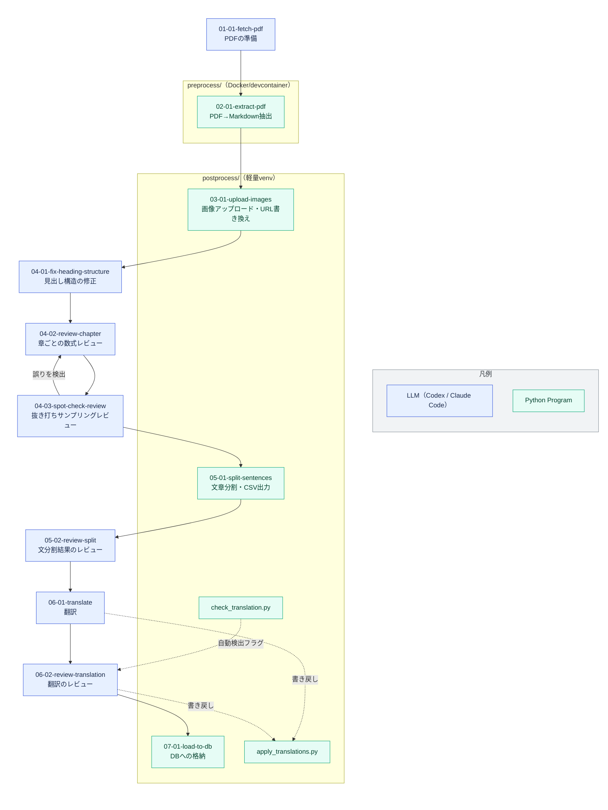

# パイプライン全体のワークフロー

## このプロジェクトの目的

GPT Site上で、論文の翻訳文と原文を行き来しながら読める論文読解支援ツールを提供する。

本リポジトリ（paper-reader）が担当するのはそのうち**前処理パイプライン**であり、範囲は以下の通り。

> 論文PDFから本文を抽出し、文単位に分割・レビューし、日本語へ翻訳して、閲覧用DBへ渡すところまで

GPT Site側の閲覧・表示UIは本リポジトリの範囲外。
DBスキーマ（[03_db.md](03_db.md)）を共有インターフェースとして、閲覧アプリ側から参照される想定。

## 全体フロー



点線は、Stepが内部で呼び出す補助Program（書き戻し・自動チェック）との関係を示す
（`apply_translations.py`は06-01・06-02の両方が書き戻しに使用、`check_translation.py`は06-02向けに自動検出フラグを生成）。

青（LLM）はCodex/Claude Codeが判断しながら実行する工程（`paper-chapter-reviewer`等のsubagent呼び出しを含む）。
緑（Program）は決定論的なPython Programの実行のみで、LLMの判断を含まない工程。

## 各ステップ

「Flow_Lv1」は同じ0X番台のStepで共通の値（例: 04-01〜04-03は3行とも同じ内容。表では結合セルで表現）。
「Flow_Lv2」はStep単体の粒度での作業内容。いずれも体言止めで記載。

<table>
<thead>
<tr><th>#</th><th>Flow_Lv1</th><th>Flow_Lv2</th><th>Skill</th><th>実行主体</th><th>入力</th><th>出力</th></tr>
</thead>
<tbody>
<tr><td>1</td><td>PDFの取得</td><td>対象PDFの<code>pdf/</code>への準備(Google Drive検索→無ければローカル確認)</td><td><a href="../.claude/skills/01-01-fetch-pdf/SKILL.md">01-01-fetch-pdf</a></td><td>LLM</td><td>対象PDFのファイル名</td><td><code>pdf/&lt;論文名&gt;.pdf</code>(ローカルに無ければGoogle Driveから取得)</td></tr>
<tr><td>2</td><td>PDF→Markdown抽出</td><td>PDFのMarkdown変換(marker-pdf + PyMuPDF)</td><td><a href="../.claude/skills/02-01-extract-pdf/SKILL.md">02-01-extract-pdf</a></td><td>Program(<code>make extract</code>)</td><td><code>pdf/&lt;論文名&gt;.pdf</code></td><td><code>output/&lt;論文名&gt;/&lt;論文名&gt;.md</code>、<code>tables/</code>(表画像)、図画像</td></tr>
<tr><td>3</td><td>画像のアップロード・URL書き換え</td><td>抽出画像(表・図)のGoogle Driveへのアップロードと、Markdown内画像参照のDrive直リンクへの書き換え</td><td><a href="../.claude/skills/03-01-upload-images/SKILL.md">03-01-upload-images</a></td><td>Program(<code>make upload-images</code>)</td><td><code>&lt;論文名&gt;.md</code>(ローカル画像参照込み)</td><td><code>&lt;論文名&gt;.md</code>(画像参照をDrive URLへ書き換え)、Google Drive共有フォルダ直下<code>&lt;論文名&gt;/</code></td></tr>
<tr><td>4</td><td rowspan="3">Markdownの見出し構造・数式の精度担保</td><td>見出し(<code>#</code>の数・親子関係)の元PDF章立てとの一致</td><td><a href="../.claude/skills/04-01-fix-heading-structure/SKILL.md">04-01-fix-heading-structure</a></td><td>LLM</td><td><code>&lt;論文名&gt;.md</code></td><td><code>&lt;論文名&gt;_review.md</code>(新規作成。以降はこれを編集)</td></tr>
<tr><td>5</td><td>章ごとの元PDF該当ページとの突き合わせによる数式修正</td><td><a href="../.claude/skills/04-02-review-chapter/SKILL.md">04-02-review-chapter</a></td><td>LLM</td><td><code>&lt;論文名&gt;_review.md</code>、元PDF</td><td><code>&lt;論文名&gt;_review.md</code>(数式修正)</td></tr>
<tr><td>6</td><td>全章完了後の抜き打ちサンプリングによる修正品質検証</td><td><a href="../.claude/skills/04-03-spot-check-review/SKILL.md">04-03-spot-check-review</a></td><td>LLM</td><td><code>&lt;論文名&gt;_review.md</code></td><td>同上(誤り検出時は5へ差し戻し)</td></tr>
<tr><td>7</td><td rowspan="2">文単位のCSV分割・精度担保</td><td>レビュー済みMarkdownの文単位分割・CSV出力(自動検出フラグも生成)</td><td><a href="../.claude/skills/05-01-split-sentences/SKILL.md">05-01-split-sentences</a></td><td>Program(<code>make split</code>)</td><td><code>&lt;論文名&gt;_review.md</code></td><td><code>&lt;論文名&gt;.csv</code>、<code>&lt;論文名&gt;_flags.csv</code></td></tr>
<tr><td>8</td><td>自動検出フラグ行の<code>_review.md</code>との突き合わせによるCSV修正</td><td><a href="../.claude/skills/05-02-review-split/SKILL.md">05-02-review-split</a></td><td>LLM</td><td><code>&lt;論文名&gt;_flags.csv</code>、<code>&lt;論文名&gt;_review.md</code></td><td><code>&lt;論文名&gt;.csv</code>(分割誤りの修正)</td></tr>
<tr><td>9</td><td rowspan="2">日本語への翻訳・精度担保</td><td>見出しノード単位での<code>original_text</code>翻訳・<code>translated_text</code>列への格納</td><td><a href="../.claude/skills/06-01-translate/SKILL.md">06-01-translate</a></td><td>LLM</td><td><code>&lt;論文名&gt;.csv</code></td><td><code>&lt;論文名&gt;.csv</code>(<code>translated_text</code>列。<code>apply_translations.py</code>経由で書き戻し)</td></tr>
<tr><td>10</td><td>自動検出フラグ中心の用語統一性・訳文自然さの確認・修正</td><td><a href="../.claude/skills/06-02-review-translation/SKILL.md">06-02-review-translation</a></td><td>LLM</td><td><code>&lt;論文名&gt;.csv</code>、<code>&lt;論文名&gt;_translation_flags.csv</code></td><td><code>&lt;論文名&gt;.csv</code>(訳文の修正)</td></tr>
<tr><td>11</td><td>DBへの格納</td><td>CSVの検証・DB(<code>papers</code>・<code>sentences</code>テーブル)への保存</td><td><a href="../.claude/skills/07-01-load-to-db/SKILL.md">07-01-load-to-db</a></td><td>Program(<code>make load-db</code>)</td><td><code>&lt;論文名&gt;.csv</code></td><td>DB(<code>papers</code>・<code>sentences</code>テーブル)</td></tr>
</tbody>
</table>


## 中間ファイルの遷移（`output/<論文名>/`配下）

```
<論文名>.drive_id        … 01-01-fetch-pdfがDrive検索でファイルを見つけた場合のみ作成。07-01-load-to-dbが読み取る
<論文名>.md              … 02-01の出力。03-01で画像参照をDrive URLへ書き換え。以降変更しない（差分確認の基準）
tables/                  … 02-01が抽出した表画像（03-01でDriveへアップロード後もローカルには残る）
<論文名>_review.md       … 04-01で作成。04-02〜04-03で数式を修正
<論文名>.csv             … 05-01で作成。05-02で分割誤りを修正 → 06-01/06-02でtranslated_text列を埋める
<論文名>_flags.csv       … 05-01が出力する分割レビュー用の自動検出候補（05-02で消費）
<論文名>_translation_flags.csv … 06-01後にcheck_translation.pyが出力する翻訳レビュー用の自動検出候補（06-02で消費）
```
